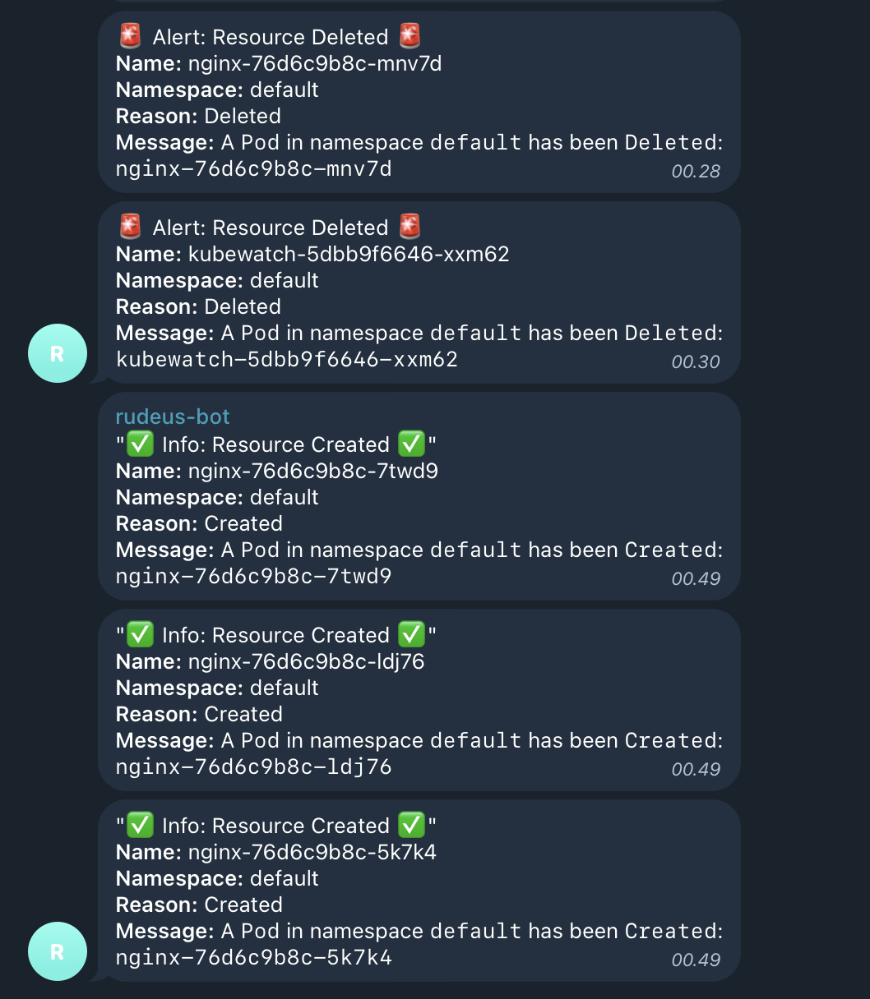

## KubeWatch Webhook for Telegram

Kubewatch: https://github.com/robusta-dev/kubewatch

## Notes
This kubewatch is reduced only for **Created** and **Deleted** resource

### Prerequisites
1. Docker
2. Python >=3.10


### How to run

1. Build the docker image
   ```bash
   $ docker build -t kubewatch-telegram-webhook . 
   ```
2. Set the Telegram environment variable, save as file called `.env.docker`
   ```bash
   TELEGRAM_CHANNEL_ID=-10xxxx
   TELEGRAM_BOT_TOKEN=1999xxxx5:AAGxxxxxx
   TELEGRAM_TOPIC_ID=1
   ```
3. Run the docker compose
   This will run on port 8000 
   ```bash
   $ docker compose up -d 

   $ docker ps                                   
    CONTAINER ID   IMAGE          COMMAND                  CREATED         STATUS         PORTS                                       NAMES
    e081d433cc3f   4a60b6e1a206   "uvicorn main:app --…"   8 minutes ago   Up 8 minutes   0.0.0.0:8000->8000/tcp, :::8000->8000/tcp   kubewatch-telegram-webhook-kubewatch-telegram-webhook-1
   ```
4. Setup https (self-signed, ngrok, etc)
   ```bash
   $ ngrok http 8000 
   ```
5. Set the kubewatch config, for this example we use Helm (deployed on Kubernetes)
    ```yaml
    namespace: ""
    rbac:
        create: true
    slack:
        enabled: false
    webhook:
        enabled: true
        url: "https://9e7c-2001-df0-9e00-00-1321-64-119.ngrok-free.app/webhook-telegram"
        tlsskip: true
    resourcesToWatch:
        deployment: true
        replicationcontroller: false
        replicaset: false
        daemonset: true
        services: true
        pod: true
        job: true
        persistentvolume: true
        namespace: true
        secret: true
        ingress: true
        event: false
    ```


### Screenshot
